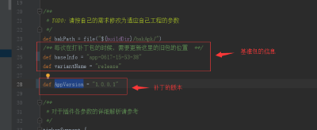
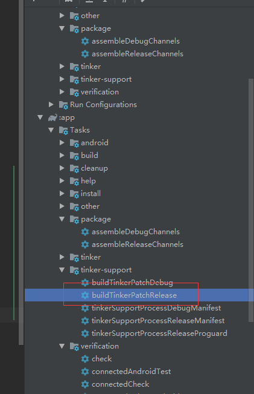
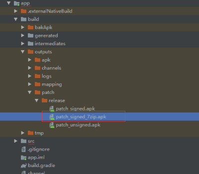

# AppAnalyticsDemo

应用统计Demo演示，集合了友盟数据统计、推送，Bugly的日志上报、热更新以及美团的多渠道打包等。

## 相关链接

* [友盟统计](https://www.umeng.com/analytics)

* [Bugly日志上报](https://bugly.qq.com/v2/products/crash-reporting)

* [美团的多渠道打包Walle](https://github.com/Meituan-Dianping/walle)

## 热更新发布流程

1.每次在修改bug前，务必修改`tinker-support.gradle`中的基准包信息。

2.进行bug修复。

3.修改`tinker-support.gradle`中补丁的版本`AppVersion`，然后执行打补丁任务（tinker-support下的任务）。

4.将build -> outputs -> patch -> release -> patch_signed_7zip.apk 的补丁上传至Bugly的热更新平台进行下发。

